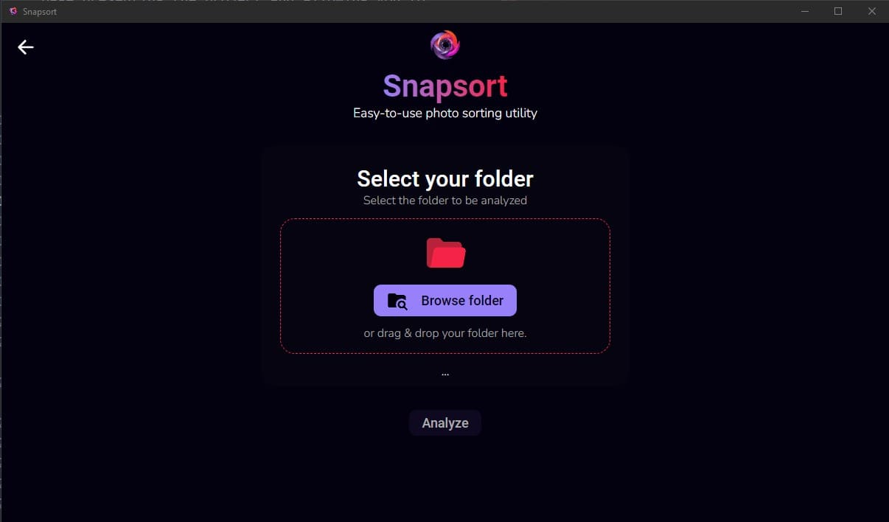

# Snapsort : Desktop utility application for sorting

## Introduction

Welcome to the Snapsort application. Snapsort is a small and simple open source desktop application that lets you sort a folder of files by year and month. It's a project I've created primarily to meet my personal need to be able to sort and organize photos from any folder in two clicks.

**Important note:** The project is currently in beta. Bugs may occur. Please [report them on GitHub](https://github.com/JohanChereau/snapsort/issues).

> **In all cases, the application doesn't delete or move files, it simply copies them.**

## Table of contents

- [Links](#links)
- [Social](#social)
- [Documentation](#documentation)
  - [Home page](#home-page)
  - [Tool - Sort files](#sort-files-tool)
    - [Option: File extensions](#file-extensions-option)
    - [Option: Edit months](#edit-months-option)
    - [Sorted export folder structure](#sorted-export-folder-structure)
  - [Tool - Analyze folders](#analyze-folders-tool)
- [Technologies used](#technologies-used)
- [Licence](#licence)

## Links

- Visit the application page : [Application page](https://snapsort.johan-chereau.com)

## Social

- **Portfolio** : [View portfolio](https://johan-chereau.com)
- **Blog** : [View blog](https://blog.johan-chereau.com)
- **LinkedIn** : [View LinkedIn profile](https://fr.linkedin.com/in/johan-chereau)

## Documentation

### Home page

When you launch the application, you arrive on a page similar to this one. At the top there's the application identity, in the center the toolbox, and at the bottom, the footer.
The application currently comprises two tools:

- [**Sort files**](#sort-files-tool): to copy files from a source folder to an export folder, sorting them and organizing them in folders according to month and year.

- [**Analyze folders**](#analyze-folders-tool): to ensure that your files are correctly organized in your export folder.
  

### Sort files tool

#### Introduction

This tool allows you to copy files from a source folder to an export folder, sorting them and organizing them in folders according to month and year.

You'll then need to select a folder containing your files to be sorted. The application will recursively search for all the files contained in this folder. You can either use the "Browse folder" button to open the Windows file explorer and select your folder, or simply drag and drop it.

For the moment, two sorting customization tools are available:

1. [File extensions](#file-extensions-option).
2. [Edit months](#edit-months-option).
   

#### File extensions option

This modal window lets you select all the file extensions you wish to include in the sort.
The selected extensions are saved as preferences and will be imported the next time the program is opened.

#### Edit months option

This modal window lets you change the names of the months to suit your preferences: whether in French, English, German ... or just initials.
The modified months are saved as preferences and will be imported the next time the program is opened.

#### Ready to sort

When the selected folders are correct, the "Sort" button is activated, enabling sorting to begin.

#### End of sorting process

During sorting, a progress bar is displayed, showing the user the percentage of progress and the file currently sorted, as well as the total number of files to be sorted.
When sorting is complete, "Done" and "100%" are displayed.

#### Sorted export folder structure

Here's an example of the sorted export folder structure.
This gives us a structure of the following form :

The export folder contains years, and each year contains months. In months, we have files whose creation date corresponds to the month of that year.

In the example, the file names are arbitrary. The program does not modify the names of your files in any way.

### Analyze folders tool

#### Introduction

This tool asks you to select a folder, to ensure that all the files it contains are correctly sorted by year and month. It's a simple utility that's not indispensable. In my case, it ensured that files that had previously been sorted by hand were correctly sorted.

This tool simply asks you to select the folder you wish to analyze, then click on the "Analyze" button to begin :

#### Successful analysis

If all files are correctly sorted, a green message appears, telling you that all files are already correctly sorted.

#### Incorrect analysis

If all files are correctly sorted, a green message appears, telling you that all files are already correctly sorted.
If the analysis detects misplaced files, the software displays a red message with the number of misplaced files. It also displays a list of all misplaced files for you to view. A simple click opens the file explorer with the selected file.

The future objective is to be able to offer an option for correcting these errors.

## Technologies Used

- **ReactJS**: Used for used for the client-side part.
- **ElectronJs**: used to create the desktop application and interact with the user's local files.
- **electron-vite**: used as a tool to build the project.
- **CSS / SASS**: Used for styling and layout of the pages.
- **TypeScript**: Used for adding interactivity and dynamic behavior to the website.
- **GSAP**: JavaScript animation library used to animate content when the application is loaded.
- **Figma**: Used for designing the user interface and creating mockups.

## Licence

> MIT License
>
> Copyright (c) 2024 Johan Chereau
>
> Permission is hereby granted, free of charge, to any person obtaining a copy
> of this software and associated documentation files (the "Software"), to deal
> in the Software without restriction, including without limitation the rights
> to use, copy, modify, merge, publish, distribute, sublicense, and/or sell
> copies of the Software, and to permit persons to whom the Software is
> furnished to do so, subject to the following conditions:
>
> The above copyright notice and this permission notice shall be included in all
> copies or substantial portions of the Software.
>
> THE SOFTWARE IS PROVIDED "AS IS", WITHOUT WARRANTY OF ANY KIND, EXPRESS OR
> IMPLIED, INCLUDING BUT NOT LIMITED TO THE WARRANTIES OF MERCHANTABILITY,
> FITNESS FOR A PARTICULAR PURPOSE AND NONINFRINGEMENT. IN NO EVENT SHALL THE
> AUTHORS OR COPYRIGHT HOLDERS BE LIABLE FOR ANY CLAIM, DAMAGES OR OTHER
> LIABILITY, WHETHER IN AN ACTION OF CONTRACT, TORT OR OTHERWISE, ARISING FROM,
> OUT OF OR IN CONNECTION WITH THE SOFTWARE OR THE USE OR OTHER DEALINGS IN THE
> SOFTWARE.
